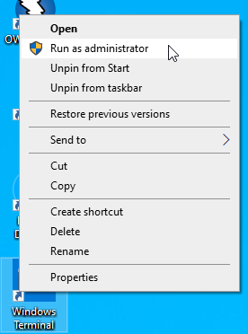
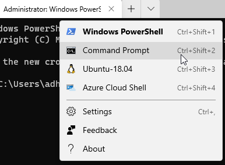
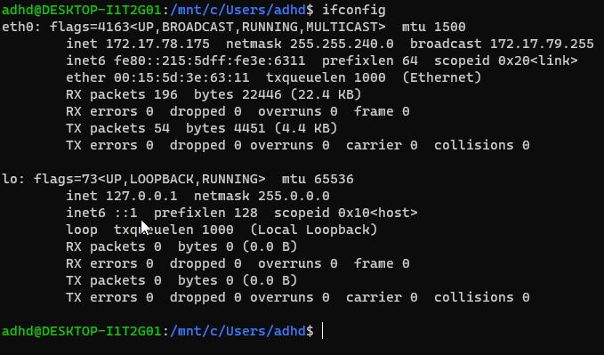
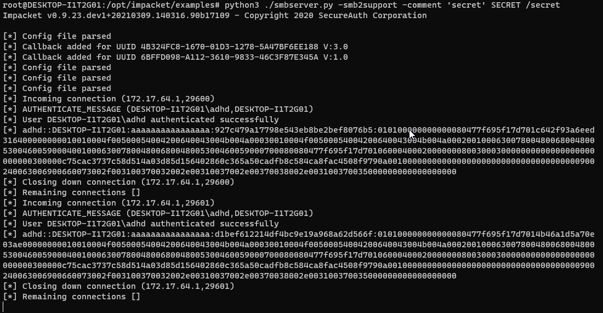

 

# Honey Share 

  

In this lab we will be creating and triggering a honey share.  The goal of this lab is to show how to set up a simple Impacket SMB server that can record attempted connections to it. 

  

This can be used for detecting lateral movement in a Windows environment.  

  

One of the cool things about this is it will track the compromised user, the system and the password hash of the compromised user account. 

  

Let's get started. 

  

First, we will need to open a terminal as Administrator: 

  

 

  

Next, we will need to open an Ubuntu Prompt: 

  

 

  

Let's get our IP address. 

  

`ifconfig` 

  

 

  

Next, we will become root and navigate to the Impacket directory: 

  

`sudo su -` 

  

`cd /opt/impacket/examples` 

  

It should look like this: 

  

 

  

Now, let's start the SMB server: 

  

`python3 ./smbserver.py -smb2support -comment 'secret' SECRET /secret` 

  

It should look like this: 

  

 

  

Next, let's open a Windows Command Prompt: 

  

 

  

Then, attempt to mount the share from your Windows system: 

  

`net use * \\172.17.78.175\secret` 

Remember!  Your IP address may be different!!! 
  

We did the most basic level of attempted authentication to the share, and it generated an error.  

  

However, the trap was triggered! 

  

Go back to your Ubuntu tab and see the log data. 

  

It should look like this: 

  

 

  

 

  

 

 
